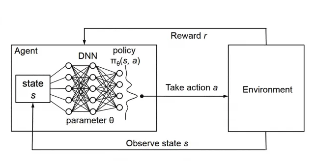
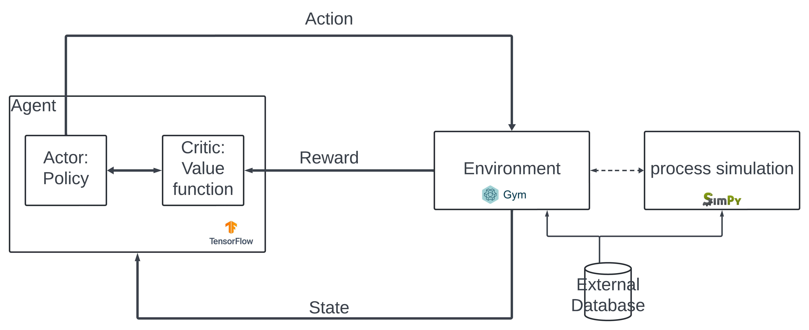

## Markov Decision Process (MDP)

A Markov Decision Process (MDP) is a mathematical framework used to model decision-making problems where outcomes are partly random and partly under the control of a decision-maker. An MDP is defined by:
- **States (S)**: A finite set of states representing the environment.
- **Actions (A)**: A finite set of actions available to an agent.
- **Transition function (T)**: The probability of reaching state \( s' \) given state \( s \) and action \( a \), written as \( P(s' | s, a) \).
- **Reward function (R)**: The immediate reward received after transitioning from state \( s \) to \( s' \) by taking action \( a \).
- **Discount factor (\( \gamma \))**: A value between 0 and 1 that determines the importance of future rewards.

The goal in an MDP is to find a policy $\pi(s)$ that maximizes the expected cumulative reward. The policy can be evaluated using the State-Value Function or the Action-Value Function.  In traditional **dynamic programming** approaches like **Value Iteration** or **Policy Iteration**, we compute the State-Value Function \( V(s) \) iteratively using the **Bellman equation**.

### State-Value Function \( V(s) \)
The value function measures the expected return starting from state \( s \) and following a policy $\pi$:

$$
V(s) = \mathbb{E}_\pi \left[ R_t + \gamma V(s') \right]
$$

This means that the value of a state is the **expected reward** plus the **discounted value of the next state**.

### Action-Value Function \( Q(s, a) \)
The **Q-function** represents the expected return from state \( s \) taking action \( a \) and then following policy \( \pi \):

$$
Q(s, a) = \mathbb{E}_\pi \left[ R_t + \gamma \max_{a'} Q(s', a') \right]
$$

This recursive formula is used in methods like **Q-learning**, where we iteratively update \( Q(s, a) \) using **tabular methods**.

## The Problem with Tabular Methods
Tabular methods like **Q-learning** work well for small state spaces but **fail when the state space is large or continuous**. This is because:
- Storing \( Q(s, a) \) in a table becomes infeasible for large environments.
- The updates are slow, requiring every state-action pair to be visited multiple times.

This is where **Deep Learning** comes in.

## Transition to Deep Learning: Function Approximation
Instead of storing values in a table, we approximate the **Q-function** (or \( V(s) \)) using a **neural network**.

### Deep Q-Network (DQN)
A **Deep Q-Network (DQN)** replaces the table-based Q-learning with a neural network that takes a state \( s \) as input and outputs \( Q(s, a) \) for each action \( a \).

$$
Q_{\theta}(s, a) \approx Q(s, a)
$$

where $\theta$ represents the weights of the neural network.

The loss function for training this network is derived from the **Bellman equation**:

$$
L(\theta) = \mathbb{E} \left[ \left( R + \gamma \max_{a'} Q_{\theta^-}(s', a') - Q_{\theta}(s, a) \right)^2 \right]
$$

where:
- $Q_{\theta}$ is the current Q-network.
- $Q_{\theta^-}$ is a **target network** (a copy of $ Q_{\theta}$ updated periodically for stability).
- $ R + \gamma \max_{a'} Q_{\theta^-}(s', a')$ is the **target Q-value**.

### Key Innovations in Deep RL
- **Experience Replay**: Instead of updating the network sequentially, we store past experiences in a buffer and sample randomly, reducing correlation between updates.
- **Target Network**: A separate network is used to compute the target Q-values, improving stability.

## Extending to Policy-Based Methods (Actor-Critic)
Instead of learning the **Q-function**, we can also directly **learn a policy $\pi(s)$ ** using policy gradient methods. One popular method is **Actor-Critic**, where:
- The **actor** learns the policy $\pi(s)$.
- The **critic** estimates the value function \( V(s) \) or the Q-value \( Q(s, a) \) to guide the actor.

This leads to methods like:
- **PPO (Proximal Policy Optimization)**
- **A3C (Asynchronous Advantage Actor-Critic)**
- 

## Partially Observable Markov Games (POMG) and Multi-Agent RL

### Partially Observable Markov Games (POMG)

A **Partially Observable Markov Game (POMG)** extends the **Markov Decision Process (MDP)** to multi-agent settings where agents have limited information about the environment.

A POMG is defined by:
- **N agents** interacting in an environment.
- Each agent **i** has a private observation \( o_i \) derived from the state \( s \).
- Each agent selects an action \( a_i \) based on \( o_i \).
- The environment transitions to a new state \( s' \) based on all agents' actions.
- Agents receive individual rewards \( R_i \), which may be cooperative or competitive.

### Multi-Agent Reinforcement Learning (MARL)

In MARL, multiple agents learn simultaneously, affecting each other’s learning process. The two primary settings are:
1. **Cooperative**: Agents share rewards and work towards a common goal.
2. **Competitive**: Agents have conflicting objectives (e.g., adversarial games).

Common MARL algorithms:
- **Independent Q-Learning**: Each agent learns its own Q-function, treating others as part of the environment.
- **Centralized Training, Decentralized Execution (CTDE)**: Agents train with shared knowledge but act independently.
- **Multi-Agent Deep Deterministic Policy Gradient (MADDPG)**: An extension of DDPG for multi-agent settings.
